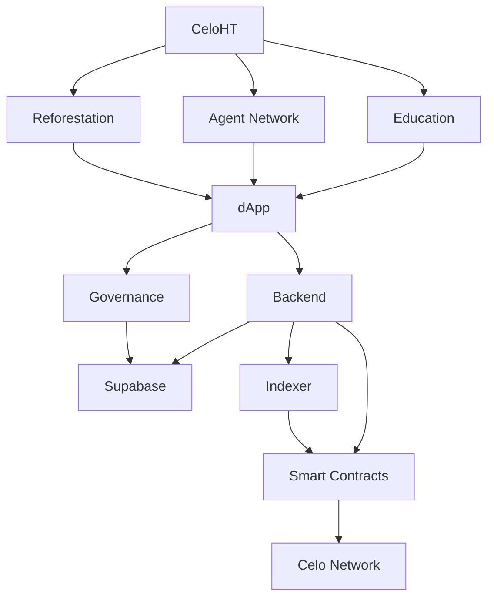

# CeloHT

**Haitian-led, open-source, community-governed digital financial inclusion initiative built on Celo.**

[](#)
[](#no-token-policy)
[](#repository-status-philosophy)
[](https://www.celoht.com)

CeloHT is a Haitian-led, open-source, community-governed initiative focused on financial inclusion, Web3 and financial education, community-based digital financial infrastructure, environmental restoration, and open research. CeloHT uses the [Celo](https://celo.org) ecosystem as its underlying technical infrastructure.

> **CeloHT is not a blockchain, cryptocurrency, exchange, investment platform, ICO, or token issuer.** See the [No Token Policy](#no-token-policy) below.

---

## Table of Contents

- [Mission](#mission)
- [Core Pillars](#core-pillars)
- [Architecture](#architecture)
- [Repository Ecosystem](#repository-ecosystem)
- [Financial Infrastructure](#financial-infrastructure)
- [No Token Policy](#no-token-policy)
- [Governance](#governance)
- [Security & Transparency](#security--transparency)
- [Responsible Communication](#responsible-communication)
- [Research & Evidence](#research--evidence)
- [Roadmap](#roadmap)
- [Community Standards](#community-standards)
- [Contributing](#contributing)
- [Repository Status Philosophy](#repository-status-philosophy)
- [Relationship with Celo](#relationship-with-celo)
- [Official Links](#official-links)

---

## Mission

CeloHT exists to help Haitian communities access digital financial tools safely, understand the technology behind them, and benefit from transparent, community-led development and environmental programs. The initiative is organized around three core pillars and supported by open documentation, open research, and open governance.

## Core Pillars

### 📚 Education

Financial literacy, Web3 education, digital security, and practical blockchain education, primarily designed for Haitian Creole-speaking communities. Education is treated as a prerequisite for responsible digital financial access, not an afterthought.

### 🤝 Agent Network

A community-rooted network of trained agents designed to help people access digital financial tools and bridge physical cash with digital services. The design emphasizes:

- Training and certification
- Verification of agent identity and conduct
- Accountability mechanisms
- User protection
- Community trust

### 🌱 Reforestation

Community-led environmental restoration with transparent reporting and measurable impact. The program is built around:

- Community participation
- Tree survival tracking
- Transparent, auditable reporting
- Measurable environmental impact
- Long-term restoration, not one-time planting events

---

## Architecture

CeloHT is organized as a multi-repository ecosystem separating user applications, backend services, blockchain infrastructure, data systems, governance, operations, documentation, research, the public website, and brand infrastructure.



This diagram reflects the current intended architecture. Individual components move through the [status lifecycle](#repository-status-philosophy) independently — the presence of a component in this diagram does not imply it is deployed to Mainnet.

---

## Repository Ecosystem

The CeloHT organization currently contains 15 repositories:

| # | Repository | Purpose |
|---|------------|---------|
| 1 | [CeloHT](https://github.com/Celo-HaiTi/CeloHT) | Core project, governance, policies, strategy, and institutional documentation |
| 2 | [.github](https://github.com/Celo-HaiTi/.github) | Organization-wide GitHub standards, templates, policies, and community infrastructure |
| 3 | [celoht-docs](https://github.com/Celo-HaiTi/celoht-docs) | Official documentation, architecture, governance, roadmap, APIs, and developer resources |
| 4 | [celoht-research](https://github.com/Celo-HaiTi/celoht-research) | Research, technical studies, RFCs, specifications, and evidence-based analysis |
| 5 | [celoht-dapp](https://github.com/Celo-HaiTi/celoht-dapp) | User-facing CeloHT decentralized application |
| 6 | [celoht-smart-contracts](https://github.com/Celo-HaiTi/celoht-smart-contracts) | Solidity smart-contract infrastructure for the CeloHT ecosystem |
| 7 | [celoht-backend](https://github.com/Celo-HaiTi/celoht-backend) | Backend services: authentication, authorization, agents/KYC, education, reforestation, governance, admin, and audit logging |
| 8 | [celoht-indexer](https://github.com/Celo-HaiTi/celoht-indexer) | Blockchain event indexing and synchronization infrastructure |
| 9 | [celoht-governance](https://github.com/Celo-HaiTi/celoht-governance) | Governance proposals, voting, treasury, timelocks, and governance infrastructure |
| 10 | [celoht-supabase](https://github.com/Celo-HaiTi/celoht-supabase) | Database, migrations, Row Level Security, and private data infrastructure |
| 11 | [celoht-admin](https://github.com/Celo-HaiTi/celoht-admin) | Operational control center and administrative dashboards |
| 12 | [celoht-siteweb](https://github.com/Celo-HaiTi/celoht-siteweb) | Official public CeloHT website |
| 13 | [celoht-brand](https://github.com/Celo-HaiTi/celoht-brand) | Official visual identity, logos, brand guidelines, messaging, and communication assets |
| 14 | [celoht-demo](https://github.com/Celo-HaiTi/celoht-demo) | Interactive demonstration of the CeloHT ecosystem *(simulation — see note below)* |
| 15 | [celoht-investor-book](https://github.com/Celo-HaiTi/celoht-investor-book) | Long-form project and ecosystem documentation |

> ⚠️ **About `celoht-demo`:** This repository is a **demonstration/simulation**. Any wallet connections, transaction hashes, dashboard figures, user metrics, or financial metrics shown in the demo are simulated for illustrative purposes and must never be interpreted as real production data, real users, or real financial activity.

---

## Financial Infrastructure

CeloHT does not build its own currency or payment rails. Instead, it uses existing Celo ecosystem infrastructure:

- **USDm** — used as a reference stablecoin for supported payment and settlement use cases
- **CELO** — used to pay transaction (gas) fees on the Celo network
- **Celo-compatible wallet infrastructure** — used for account and transaction handling

CeloHT did **not** create USDm or CELO, does **not** operate a bank, and does **not** control the Celo network. CeloHT is a downstream, independent user of Celo's public infrastructure.

---

## No Token Policy

**CeloHT has no native token.**

There is:

- ❌ No CeloHT token
- ❌ No "$CELOHT"
- ❌ No ICO
- ❌ No presale
- ❌ No private token sale
- ❌ No staking token
- ❌ No token-weighted governance
- ❌ No investment promise

CeloHT relies on existing Celo ecosystem infrastructure rather than issuing a speculative CeloHT token. **Any token, presale, or investment offer claiming to represent CeloHT is unauthorized and does not originate from this project.**

Full policy: [`NO_TOKEN_POLICY.md`](https://github.com/Celo-HaiTi/CeloHT/blob/main/NO_TOKEN_POLICY.md)

---

## Governance

CeloHT is a community-governed open-source initiative. Governance is based on participation, contribution, documented processes, and community responsibility — **not token ownership**.

Governance structures may include:

- Governance Council
- Working Groups
- Maintainers
- Contributors
- Open community participation

CeloHT is **not** described as an already-operational DAO. Where DAO-style governance is discussed, it represents a future, phased design goal rather than current operational reality. Details are tracked in [`celoht-governance`](https://github.com/Celo-HaiTi/celoht-governance).

---

## Security & Transparency

CeloHT distinguishes clearly between stages of readiness:

```
Development → Testing → Testnet → Security Review → Production Readiness → Mainnet
```

Testnet deployment is **never** treated as equivalent to a completed security audit or production readiness. Mainnet activation is a distinct security and operational milestone, reached only after dedicated review.

Security practices emphasized across the ecosystem include:

- Secure development practices
- Access control
- Audit logging
- Responsible disclosure
- Smart-contract review
- Protection of private data
- Deployment transparency
- Public security documentation

See [`SECURITY.md`](https://github.com/Celo-HaiTi/.github/blob/main/SECURITY.md) for responsible disclosure procedures.

---

## Responsible Communication

CeloHT does not intentionally fabricate users, transactions, partnerships, environmental impact, community statistics, production deployments, or investment results.

Anything that is **simulated**, **planned**, **experimental**, **under development**, or **testnet-only** is clearly labeled as such throughout the ecosystem.

> **Transparency is part of the product.**

---

## Research & Evidence

CeloHT maintains dedicated research infrastructure to evaluate whether its programs actually work, not simply to report activity. Research areas include:

- Financial inclusion outcomes
- Education outcomes
- Agent network performance
- Digital payment adoption
- Governance effectiveness
- Security
- Environmental impact and tree survival
- Economic sustainability
- Technical architecture

See [`celoht-research`](https://github.com/Celo-HaiTi/celoht-research) for studies, RFCs, and specifications.

---

## Roadmap

| Phase | Timeline | Focus |
|-------|----------|-------|
| **1 — Foundation** | 2026 Q2–Q3 | Documentation, open-source foundation, initial agent cohort, partnerships, core infrastructure |
| **2 — Validation** | 2026 Q4–2027 Q1 | Pilot validation, end-to-end infrastructure testing, agent workflows, security and production readiness, dApp alpha |
| **3 — Growth** | 2027 | Agent network expansion, public dApp beta, education expansion, environmental programs, Caribbean partnerships |
| **4 — Maturity** | 2028+ | Greater governance decentralization, sustainability, mature impact measurement, regional expansion |

Full roadmap: [`celoht-docs`](https://github.com/Celo-HaiTi/celoht-docs)

---

## Community Standards

This `.github` repository provides shared organizational standards applied across the CeloHT ecosystem, including:

- [Code of Conduct](https://github.com/Celo-HaiTi/.github/blob/main/CODE_OF_CONDUCT.md)
- [Contribution Guidelines](https://github.com/Celo-HaiTi/.github/blob/main/CONTRIBUTING.md)
- [Security Policy](https://github.com/Celo-HaiTi/.github/blob/main/SECURITY.md)
- Issue templates
- Pull request standards
- Documentation standards
- Responsible disclosure procedures

---

## Contributing

CeloHT welcomes contributions across many disciplines, including:

- Software development
- Security
- Documentation
- Research
- Education
- Design
- Testing
- Environmental initiatives
- Translation
- Community development

Before contributing, please review:

- [`CONTRIBUTING.md`](https://github.com/Celo-HaiTi/.github/blob/main/CONTRIBUTING.md)
- [`CODE_OF_CONDUCT.md`](https://github.com/Celo-HaiTi/.github/blob/main/CODE_OF_CONDUCT.md)
- [`SECURITY.md`](https://github.com/Celo-HaiTi/.github/blob/main/SECURITY.md)

---

## Repository Status Philosophy

Every repository and component in the CeloHT ecosystem is labeled according to its actual readiness level. A repository must never imply a higher readiness level than the evidence supports.

| Status | Meaning |
|--------|---------|
| Experimental | Early experimentation |
| Development | Active implementation |
| Testnet | Deployed for testing |
| Security Review | Under security validation |
| Production Ready | Meets defined production requirements |
| Mainnet | Operational on Mainnet |
| Archived | No longer actively maintained |

---

## Relationship with Celo

CeloHT is an **independent, open-source initiative** that uses Celo's public blockchain infrastructure. CeloHT does not own or control the Celo network, and this project is not an official product or endorsement of the Celo Foundation or any wallet provider. References to Celo, USDm, and CELO describe the infrastructure CeloHT builds on top of, not affiliations or endorsements.

---

## Official Links

- 🏢 **GitHub Organization:** [github.com/Celo-HaiTi](https://github.com/Celo-HaiTi)
- 📖 **Documentation:** [celoht-docs](https://github.com/Celo-HaiTi/celoht-docs)
- 🔬 **Research:** [celoht-research](https://github.com/Celo-HaiTi/celoht-research)
- 🌐 **Website:** [celoht.com](https://www.celoht.com)
- 💬 **Discussions:** [github.com/Celo-HaiTi/CeloHT/discussions](https://github.com/Celo-HaiTi/CeloHT/discussions)
- 🎨 **Brand:** [celoht-brand](https://github.com/Celo-HaiTi/celoht-brand)

---

<sub>CeloHT is a community-governed, open-source initiative. This document reflects the current state of the project and will evolve as the ecosystem matures.</sub>
